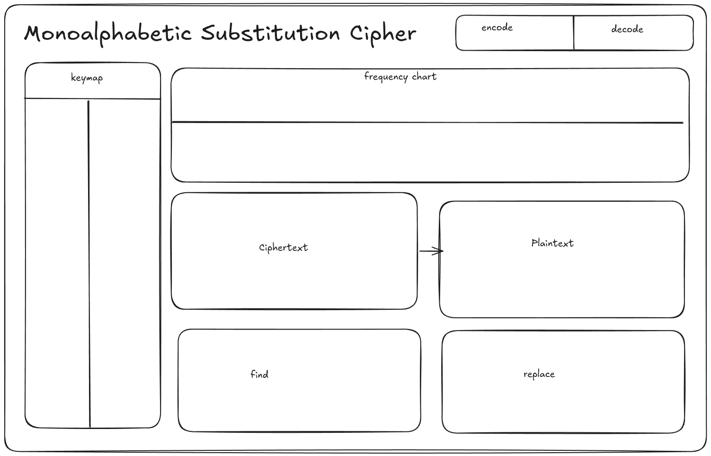

# Day 02

The project is a typical Vite app with the following structure:

````
alkindi/src/
├── App.css
├── App.tsx
├── components
│   └── monoalphabetic
│       ├── ciphertext_plaintext.tsx
│       ├── encode_decode.tsx
│       ├── find_replace.tsx
│       ├── frequency_chart.tsx
│       └── keymap.tsx
├── index.css
├── main.tsx
├── pages
│   └── Monoalphabetic.tsx
├── types
│   └── CounterMap.ts
└── utilities
    ├── Counter.ts
    └── EnglishFrequency.ts

6 directories, 13 files
````

I added a couple of changes to it since last time.

The keymap keeps a track of which character is mapped to what (null if mapped to nothing). Changes are made to the keymap by other components, and only keymap can change the plaintext.

The find and replace is a simple, 2 input field component that takes in a string, finds it in the ciphertext and replaces it (on a very high level). In reality, it's better for it to use the keymap to do this as well- their functionalities overlap anyway.

Frequency chart is just a bar chart made with [Recharts](https://recharts.github.io/) for visualising the counter object, we worked on in the last video. It tracks the counter for the ciphertext and returns a bar graph for the frequency of all the characters. It re-renders everytime the ciphertext state changes. It also renders another bar chart for the frequency of English alphabets. I had to add a new method `getChartData()` to make things easier.

All these components are rendered on the page for monoalphabetic cipher. The ciphertext state is tracked by this page. This will help in passing it down to different components as a prop. Although if things start to go out of hand, I can make it into a React context.

What's left to implement is the undo and redo stacks. Updates to this are going to be single character (keymap) or in batches (find and replace). This needs to be researched and thought out, because I don't know how to best implement this.

For now here's what we have so far:


# Day 01

## Monoalphabetic UI

Worked on the component for [ciphertext](https://en.wikipedia.org/wiki/Ciphertext) and [plaintext](https://en.wikipedia.org/wiki/Plaintext). Nothing fancy, just two states that I have to manage. The `plaintext` state is going to be changed by the user's actions. I'm going to have to put the changes that the user is going to apply in a stack of sorts, so even if the `ciphertext` is changed, I can just reapply the changes on the stack (for example, adding more text in the ciphertext field).

Also planned out a rough outline of how the UI for the monoalphabetic cipher is going to look like. Very professional if I say so myself (/s). That being said, I'm pretty sure that I'm going to end up changing and simplifying it but that's all for today.



# Day 00

Frontend is a necessary evil. I learned that the hard way, after participating in hackathons and looking at real world projects. I need to brush up my frontend scripts even if I am trying to head into cybersecurity.

What I needed was a project that nicely balances out frontend development, cybersecurity and logic. For the longest time I have sat on prototypes of this idea, but now I think I'm in a good position to actually start it.

This isn't one of my usual blogs, rather a devlog of sorts to keep me in check. I'll keep coming back and editing it as I see fit, but a friend of mine told me to focus on what's keeping me interested instead of focusing on goals. That's a nice way to live in my opinion. I'll worry about placements when I get to them.

I'll start with what I implemented today.

## [Counter](https://github.com/syswraith/alkindi/blob/master/src/utilities/Counter.ts)

Very recently, I came across the [collections.Counter](https://docs.python.org/3/library/collections.html#collections.Counter) object in Python. It's a nifty little piece of code that reduces the number of times I have to use loops for something like getting a frequency count on an iterable. My goal today was to replicate a subset of its functionality and implement two basic getter functions I know for sure that I'm going to need.

* `getMap()` Returns a map with frequency by occurrence of each element in the iterable.
* `getPercentMap()` Returns a map with frequency by percentage of each element in the iterable.

Internally, I wanted the `Map()` object to be restricted to strings and numbers (just in case). For this I learned that one must use getters and setters over normal indexing. Also I learned about the [nullish coalescing operator](https://www.typescriptlang.org/docs/handbook/release-notes/typescript-3-7.html#nullish-coalescing) which is used when you want to default to a value if you encounter `null` or `undefined`.

Below is a loop to iterate over an iterable and count its frequency.

````ts
for (let i of this.iterable) {
	this.map.set(i, (this.map.get(i) ?? 0) + 1);
}
````

Another trick that I used to calculate frequency was the usage of [Array.prototype.reduce()](https://developer.mozilla.org/en-US/docs/Web/JavaScript/Reference/Global_Objects/Array/reduce). This method makes calculating the running sum easier. The [spread operator (...)](https://developer.mozilla.org/en-US/docs/Web/JavaScript/Reference/Operators/Spread_syntax) allows one to unpack an iterable inside of another iterable (in this case, an array) and then calling the reduce function on it spares us a loop. Also note that without the curly braces, the [arrow operator](https://developer.mozilla.org/en-US/docs/Web/JavaScript/Reference/Functions/Arrow_functions) will auto-return the values computed inside (basically acting as a [lambda function](https://en.wikipedia.org/wiki/Anonymous_function)).

````ts
let total = [...this.map.values()].reduce((sum, number) => (sum + number), 0);
````
