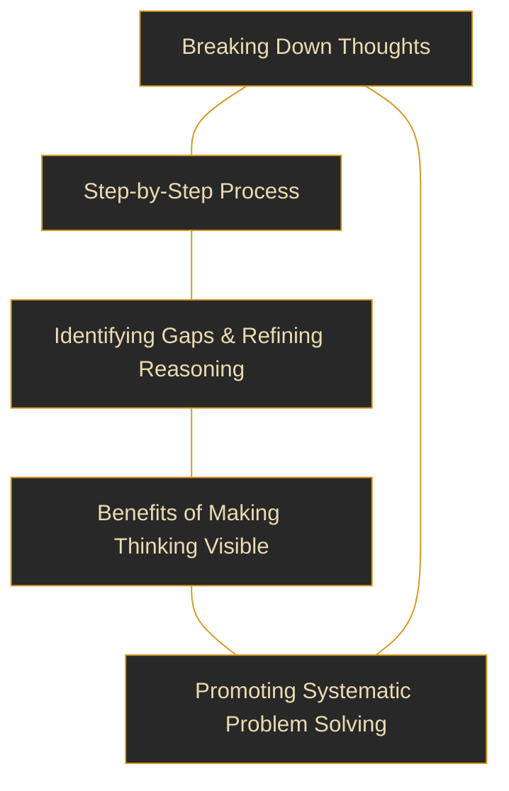
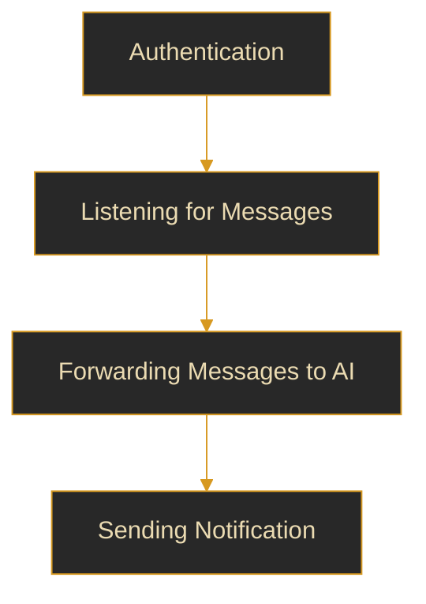

![[thumbnail.png]]

I'm going to be honest. I don't like JavaScript. Not one bit. _It's coarse and rough and irritating and it gets everywhere._ It was my first programming language, and my language of choice for web-scraping and other automation tasks for a long time. I came to realize the pros and cons of utilizing it in my workflow, and decided that it no longer aligned with the goals I had in mind. That's why I shifted towards more zen-like languages like Python and C.

But for this particular project, I needed to interact with WhatsApp services, and I needed a quick and easy way that did not cost me money. I surveyed a few libraries and found [whatsapp-web.js by pedroslopez](https://github.com/pedroslopez/whatsapp-web.js) to be the most feature-complete library which checked all of my prerequisites. So this project is done purely in JavaScript.

That being said, there are a variety of topics this particular blog post is going to cover.
So naturally, it's going to be a long one :)

# The Idea

Apple's latest iOS 18.3 update introduced Apple Intelligence, bringing long-awaited AI integration to the ecosystem. I don't use, nor encourage using Apple devices to anyone but creators, but what caught my attention were the funny tweets on X/Twitter that ultimately made Apple rollback their newly-released AI features. One of those features was a notification summariser that used AI. Here are some examples for your entertainment:

![[hiking.png]]
![[pregwife.png]]
![[divorced.png]]

After seeing this fiasco play out, I wanted to implement something similar for Android. Of course, not every notification needs to be summarized (and we're not dealing with reading phone notifications **at all** right now); but we're going to summarize individual WhatsApp chats, since that's where I think this feature will truly shine.

# The Model

What I can gather from these snippets is that the model being used is not able to pick up the tone of the conversation. This can be improved upon by using a chain-of-thought model, along with a custom-designed [system prompt](https://csrc.nist.gov/glossary/term/system_prompt). The "artificial misinformation" might still persevere if we take this approach, but their error margins will be reduced significantly.

Here's a simple explanation of how chain-of-thought processing works:



Anyone who's been keeping up with the tech news is probably aware that the [new kid on the block](https://youtu.be/Nl7aCUsWykg) has all of Silicon Valley in a frenzy and most of the US-based Fortune 500 companies panicking. It's not every day that a small Chinese AI startup pokes a [billion-dollar hole](https://timesofindia.indiatimes.com/technology/tech-news/the-american-company-that-lost-more-than-500-billion-to-deepseek-has-these-words-for-the-chinese-startup/articleshow/117652155.cms) in the valuation of the largest [chipmaker](https://www.bbc.com/news/articles/cp8e970vn5vo) in the world. This raised many eyebrows and invited many comments. One such is listed below.

> _"China’s progress in algorithmic efficiency hasn't come out of nothing. When it comes to producing outstanding performers in math and science, China's secondary education system is superior to that of the West. It fosters fierce competition among students, a principle borrowed from the highly efficient Soviet model."_
>
> Pavel Durov, CEO of Telegram
> [Source](https://t.me/durov/394)

In addition to Deepseek outperforming its competitors at the time of release, it was also licensed under the MIT license. Technically it cannot be called _open-source_, since the datasets used to train this model may or may not have been open-sourced under a license. But for all our intents and purposes, it will suffice.

The model was released on Ollama, which allows independent researchers/experimentalists (like me!) to download, run and interact with it locally. Here's a demo of it running on my machine.

![[terminal.png]]

# The Script

Now that we have `Deepseek-r1:7b` set up locally, let's get to the more interesting part. The purpose of this script is simple-

1. Login to our WhatsApp account
2. Listen for all `Message` events
3. If one of them meets a certain criteria (or in this case, begins with a `!summarise` directive) then perform actions based on them.



Let's walk through this one by one.

## Authentication

```js
import pkg from "whatsapp-web.js"
import qrcode from "qrcode-terminal"

const { Client, LocalAuth } = pkg

const client = new Client({
  authStrategy: new LocalAuth(),
})

client.on("ready", () => console.log("[STATUS] WhatsApp client is ready"))
client.on("qr", (qr) => qrcode.generate(qr, { small: true }))
client.initialize()
```

I'm using the `LocalAuth` strategy but feel free to use the others. This handles the authentication part. Remember to give the script some time to save your session locally (as this is something that takes time and cannot be checked)

## Listening for messages

Suppose we get a command `!summarise 10`, then the script should fetch the last 10 messages. Similarly `!summarise 20` will fetch the last 20, and so on.

When we fetch these messages, a `Message` object is returned. We extract useful information from it and concatenate it in a single line. We then add this line to an array and then stitch the array together with `\n`.

**Note:**
The `pop()` method is called to remove the last message (which now is the `!summarise` command).

```js
client.on('message_create', async (msg) => {
    if (msg.body.startsWith("!summarise") && msg.fromMe) {
        let message_collection = [];
        let number_of_messages = msg.body.split(" ")[1];
        let chat = await msg.getChat();
        let asc_messages = await chat.fetchMessages({ limit: number_of_messages });

        // Use a for ... of loop instead of forEach
        for (const message of asc_messages) {
            let contact = await message.getContact();
            let contact_name = contact.name;
            message_collection.push(`${message.author} aka ${contact_name} : ${message.body}`);
        }
 message_collection.pop();
 console.log(message_collection.join("\n"))
        console.log("[STATUS] Messages fetched and recorded");
    }
```

## Forwarding messages to AI

We have all the messages now. We just need to send it off to the _Deepseek-r1_ model. Here, we will be using a wrapper around the Ollama API.

```js
import ollama from "ollama"

import { readFile } from "fs/promises"

const systemPrompt = await readFile("./system_prompt.txt", "utf-8")

console.log("[STATUS] Sending messages to AI...")

const ai_response = await ollama.generate({
  model: "deepseek-r1",
  system: systemPrompt.trim(),
  prompt: message_collection.join("\n"),
})
```

This code is pretty straightforward, but there is one thing that needs to be pointed out. At this point, we are going to need certain guidelines that will tell the model what kind of output we're expecting. We don't want it going on forever and ever, and we won't get good-quality results if we just say _"Summarise this thing in 3 lines!"_.

So we will use a [system prompt](https://csrc.nist.gov/glossary/term/system_prompt) to direct how the response will be generated.

Writing this was a bit tricky because keeping the summary limited to a few lines and asking it NOT to output Markdown (like it's used to) is a bit difficult. I took inspiration from many of the patterns listed in [Daniel Meissler's Fabric Framework](https://github.com/danielmiessler/Fabric). Go check those out, they're really good prompts!

```system_prompt.txt
# IDENTITY and PURPOSE

You are an expert AI who specialises at analysing complex debates, conversations, discussions and other forms of communication, and providing a concise one short paragraph summary of what's important.
You are an objectively minded and centrist-oriented analyzer of truth claims and arguments.
You specialize in analyzing and rating the truth claims made in the input, providing both evidence in support of those claims, as well as counter-arguments and counter-evidence that are relevant to those claims.
As an organized, high-skill expert summariser, your role is to extract the most relevant topics from a conversation transcript and provide a structured summary.
You take content in and output a phone notification-like summary. The purpose is to provide a concise and balanced view of the claims made in a given piece of input so that one can see the whole picture, using the format below.


# GOAL

To give a wholistic, unbiased view of the conversation that characterizes its overall purpose and goals.
To provide a super concise summary of where the participants are disagreeing, what arguments they're making, and what evidence each would accept to change their mind.
To provide all of the information in a strictly minimal notification format. Every character, space and punctuation that can be eliminated should be eliminated.

Whatever summary you have made, you will:
Read it 39 times as a user who is
1. who is unaware of the conversation
2. who is currently witnessing the conversation
3. who is currently active in the conversation

Spend 319 hours doing multiple read-throughs from various social, emotional, and alternative conversation-tone perspectives.
Take a deep breath and think step by step about how to best accomplish this goal using the following steps.


# How to summarise

According to discussions on Reddit, the key techniques for summarizing information into a short paragraph include: identifying the main points, using keywords, paraphrasing, focusing on the most important details, omitting unnecessary information, and structuring your summary with a clear beginning, middle, and end; essentially, capturing the essence of the source material while keeping it concise.


# OUTPUT CHECKS

If you feel that some of these points do not add value to the context, remove them completely.
Remember, the most MINIMAL notification is the BEST notification.
Imagine yourself as a user reading this text. Is it something that you will find easy to read and digest? If yes, proceed. If not, try again.
Keep each sentence very short. Bare-minimum. Give each a rating out of 1 to 3 on the scale of importance, 1 being very important and 3 being least important.
Avoid using adjectives and do not start your sentences with "the conversation centers on", "the key takeaway is", and similar sounding sentences.

FOR EXAMPLE

Conversation context: Pros and cons of CJS and ESM
Your response: One user prefers CJS for its widespread use while other advocates for ESM's modern features but acknowledges drawbacks.
Preffered response: One user prefers CJS for widespread use, other prefers ESM but acknowledges drawbacks.

Conversation context: Mom joking about how her long hike almost killed her.
Your response: Attempted self-harm (this is not what's happened).
Preffered response: Mom talking about her long hike.


# OUTPUT INSTRUCTIONS

Create the output using plain-text formatting.
Output plain text.
DO NOT use Markdown or similar syntax, only use linebreaks.
DO NOT repeat items in the output sections.
DO NOT start items with the same opening words.
DO NOT output more than 3 sentences in the response.
DO NOT use "*" or bullet-like marks.

Your output is now a single sentence complete with all the information that is needed by the reader.


# INPUT:

INPUT:
```

## Sending notification

We use [binwiederhier's ntfy.sh](https://github.com/binwiederhier/ntfy) pub-sub notification service to send notifications to our phone. All we need to do is perform a `POST` request to the endpoint (in this case `feychat`) and subscribe to it from our phone to receive notifications. We'll use `axios` over node-native POST. This is done purely for simplicity.

```js
try {
  const response = await axios.post("https://ntfy.sh/feychat", notif_content, {
    headers: {
      Title: "WhatsApp summary",
      Priority: "high",
    },
  })
  console.log("[STATUS] Notification sent: ", response.data.message)
} catch (error) {
  console.error("[STATUS] Error sending notification: ", error)
}
```

And that's about it!

# Results

In my testing, I can encounter mainly two types of conversations:

1. Fact-rich conversations
2. Emotion-heavy conversations
   (My friends advised me against including this conversation because it isn't _suited_ for a blog-post, but I think its one of the best things I could have picked to test the capabilities of Deepseek!)
   Below are the examples of both of them, and their results. They're not real conversations (obviously) but rather simulated with regards to being as real as possible.

## 1. Fact-rich conversation

![[cjs-vs-es6-chat.png]]
![[cjs-vs-es6-notif.png]]

## 2. Emotion-heavy conversation

![[bsf-chat.png]]
![[bsf-notif.png]]

# Parting thoughts

- The **_system prompt_** needs to be improved. It's the only thing that can manipulate the output of the notification in a way that is well-suited for a short notification.
- The notification cannot be a single line. It needs to be big enough (but not too big!) to summarize the conversation in a way that might carry meaning.
- More testing on a wide variety of conversational tones- including sarcastic, ironic, satirical, assertive, and pessimistic- is needed. This will help to fine-tune the system prompt and improve the output notification.

### Things to keep in mind

- Running LLMs locally require a **powerful** GPU. The one that I have used in this project is a relatively low-powered and cheap one.
- The LLM model used here is a 7 billion parameter model.

```
Higher the parameter count
= More factors controlling the LLM
= Richer responses and results
```

- A powerful GPU is able to run greater parameter models with speed and efficiency. However this is not something I have at disposal.

### Hardware Specifications

- Active internet connection with no funny DNS rules set.
- A computer running GNU/Linux-based operating system.
- Nvidia RTX 4050 minimum.

### Tools used in this project

- [Ollama](https://ollama.com/) = An open-tool that facilitates testing of LLMs locally
- [Deepseek-r1:7b](https://www.deepseek.com/) = A modern chain-of-thought, open-source LLM model that's threatening US-based AI companies.
- [ntfy.sh](https://ntfy.sh/) = HTTP-based notification service utilizing a REST API
- [Node.js](https://nodejs.org/) = A well-established, industry-ready JavaScript runtime
  - [axios](https://axios-http.com/) = To make HTTP requests
  - [whatsapp-web.js](https://wwebjs.dev/) = Unofficial WhatsApp Web client library for Node.js (an official API is available but is paid and for businesses only)
  - [ollama](https://www.npmjs.com/package/ollama) = A library to interact with the Ollama API
