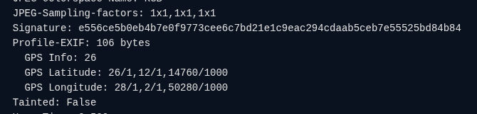
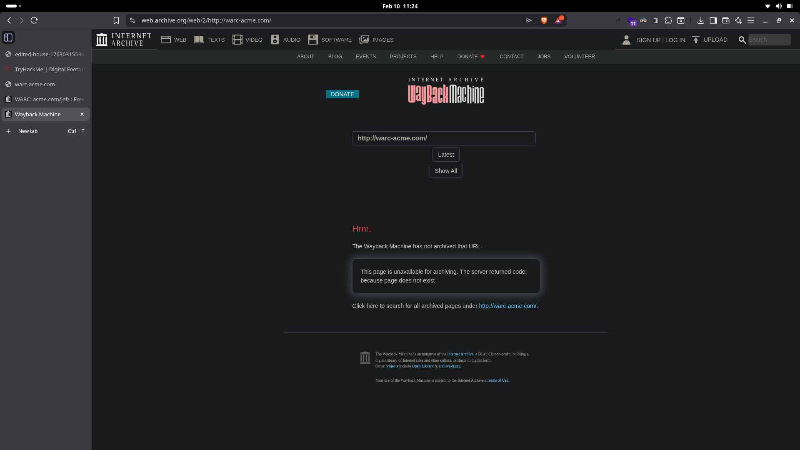
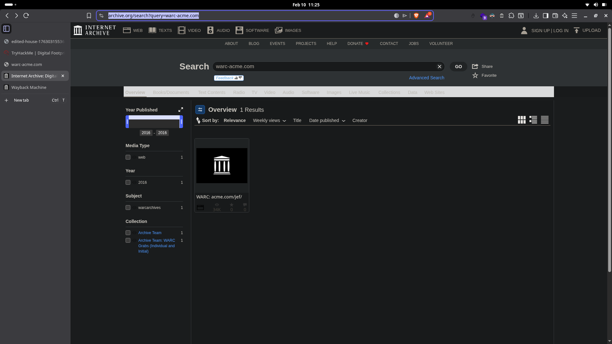
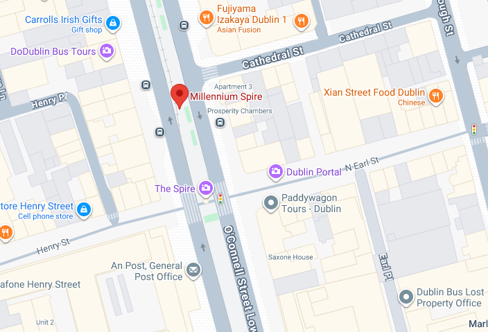
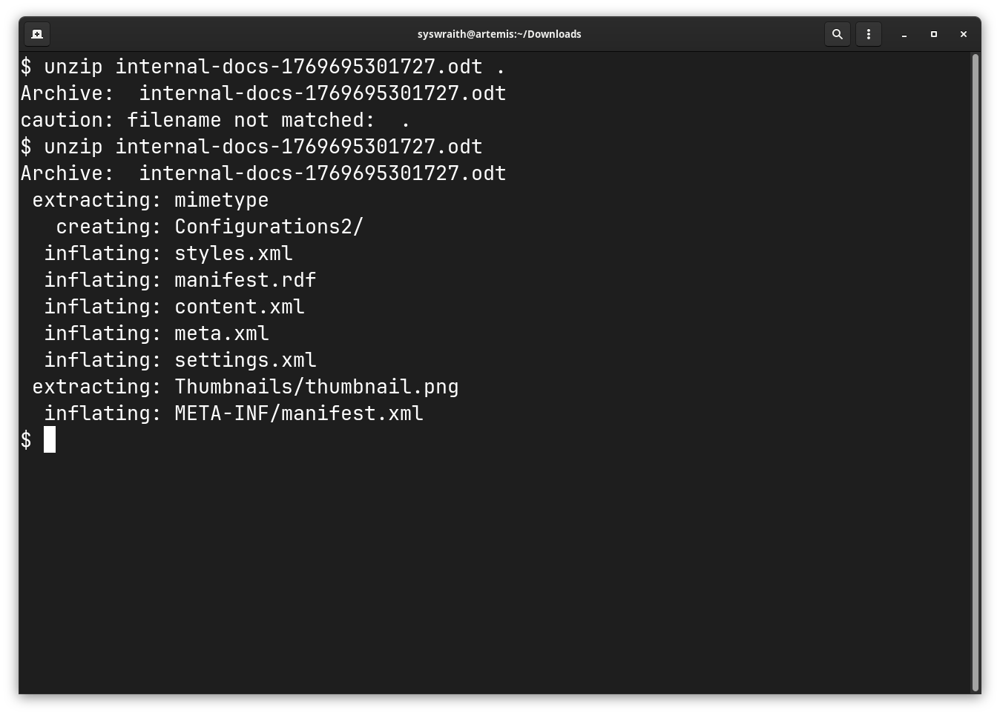
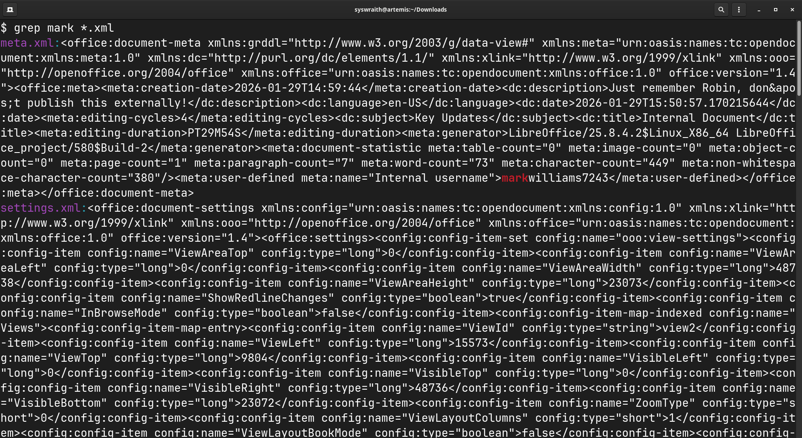
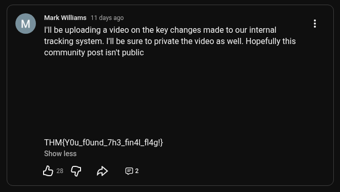

This is a write-up for the room **[Digital Footprint](https://tryhackme.com/room/osintchallengeiv)** on [TryHackMe](https://tryhackme.com/)

# 1. The Leaked Photo

### Challenge description:

Find the name of the city where the photo was taken in.


First things first, let's check the EXIF data of the file with our trusted companion: **[Aperi'Solve](https://aperisolve.fr/)**
We can see that the image has the GPS data embedded in it.



Converting this data into proper longitude and latitude coordinates, we get the following result:

**Latitude:** 26° 12' 14.76" S
**Longitude:** 28° 02' 50.28" E

The corresponding Google Maps link is this https://maps.app.goo.gl/WBR6aSFipPG7wGTR9. The city is `Johannesburg`.

# 2. Archived Company Website

### Challenge description:

Find the founding date of the company.

We're given a website [warc-acme.com/jef/](https://warc-acme.com/jef/) which has died long ago. We need to find the founding date of the company.

My first instinct is to check the wayback machine for any archived urls. But this did not return any results.



Then I just turned to the Internet Archive itself to check if anyone has uploaded any documents containing the URL, and tada.



For context, WARC stand for Web Archive and is a file format that is used by organisations like the Internet Archive to snapshot a particular website at a particular point in time.

https://archive.org/details/warc-acme.com-jef

The first file date on this is `20160210224602` which is our required flag.

# 3. Mysterious Landmark

### Challenge description:

Find the landmark from the image of the famous monument.


Doing a quick image search on this reveals it to be the **Spire of Dublin** (also known as the **Millennium Spire**). We can inspect this by checking the images and the street view.



The General Post Office is what we're looking for.

# 4. Internal Documents

### Challenge description:

Find the flag from the ODT file.

My only experience with ODT files is when I'm desperate enough to use LibreOffice Writer. When I opened the file with that, I get the following text:

````
From: Mark
To: Robin

This document outlines recent updates made to the internal tracking system. I will be releasing a video very soon, I implore everyone to watch it!  
  
There have been multiple improvements we’ve made:  
  
- Optimised database queries
- Improved user authentication logging
- Minor bug fixes across the platform
- More fixes mentioned but they’d be too long to list

All developers are reminded not to share interal documentation externally.
````

That's not very helpful. A bit of research on the ODT file format lead me to this article.

According to Wikipedia as mentioned [here](https://en.wikipedia.org/wiki/OpenDocument)

 > 
 > **OpenDocument Format** (**ODF**) **for Office Applications**, also known as **OpenDocument**, standardized as **ISO 26300**, is an [open file format](https://en.wikipedia.org/wiki/Open_file_format "Open file format") for [word processing](https://en.wikipedia.org/wiki/Word_processor "Word processor") documents, [spreadsheets](https://en.wikipedia.org/wiki/Spreadsheet "Spreadsheet"), [presentations](https://en.wikipedia.org/wiki/Presentation_program "Presentation program") and graphics using [ZIP](https://en.wikipedia.org/wiki/Zip_(file_format) "Zip (file format)")-compressed[\[6\]](https://en.wikipedia.org/wiki/OpenDocument#cite_note-6) [XML](https://en.wikipedia.org/wiki/XML "XML") files. It was developed with the aim of providing an open, XML-based file format specification for office applications.

Emphasis on ZIP-compressed format. We can just try unzipping the document.


Let's `grep` the word `mark` in all the XML files.



Monkey see, monkey do. I tried entering the username as the flag but got rejected :(

Now the document mentions that the developer is about to enter a demo video somewhere. We can try guessing the somewhere to be YouTube.

https://www.youtube.com/@markwilliams7243

And there's the flag!


