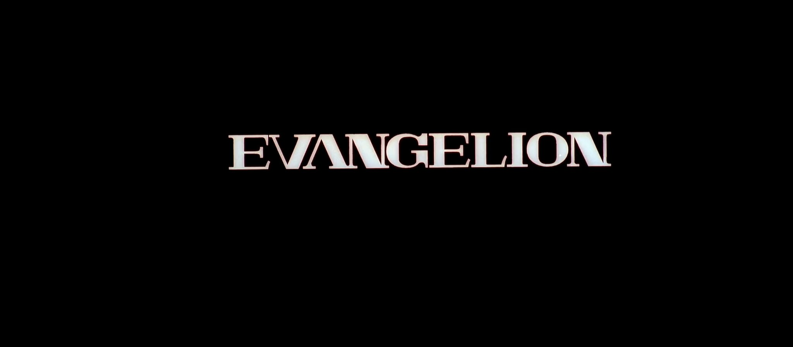
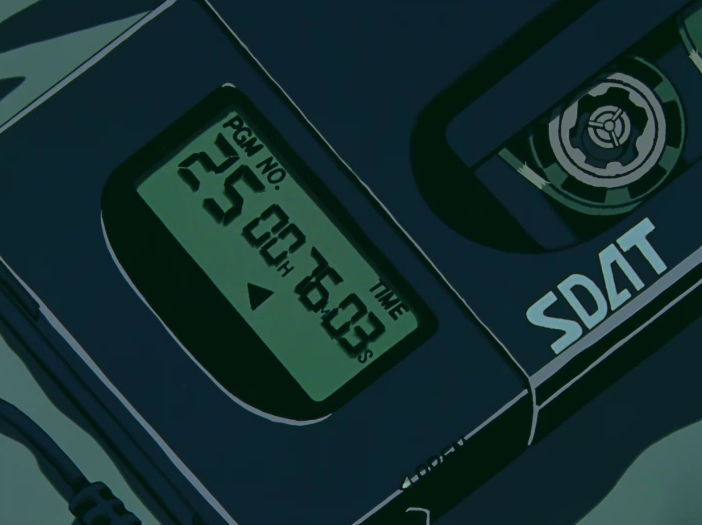
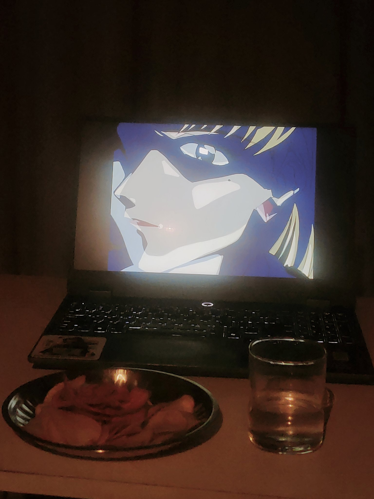
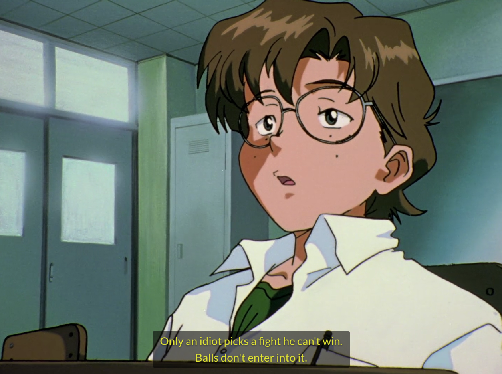
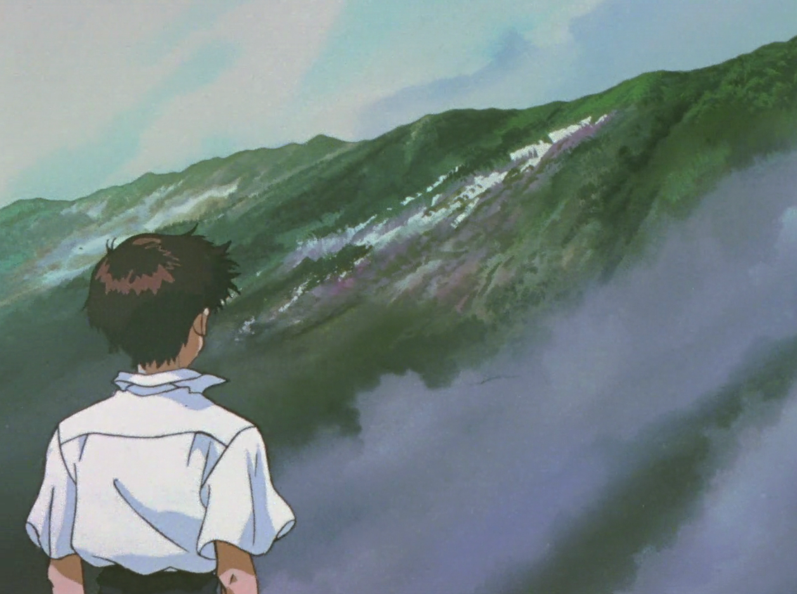
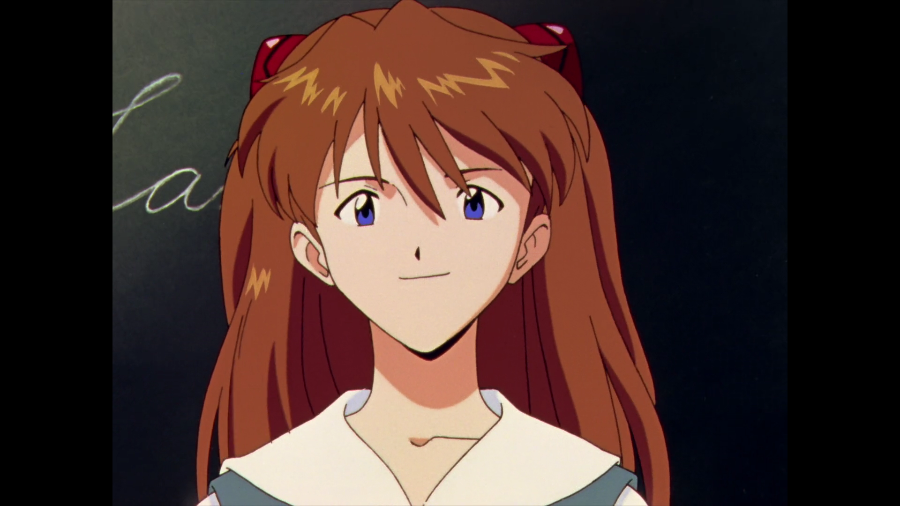
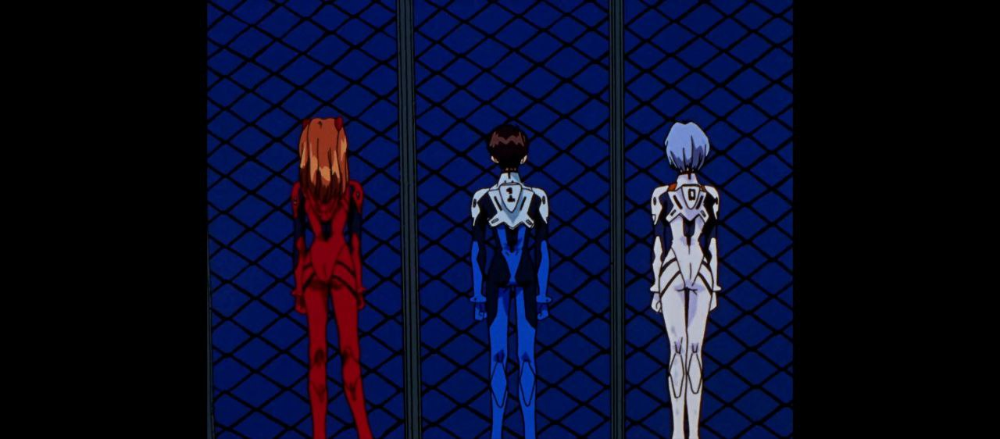
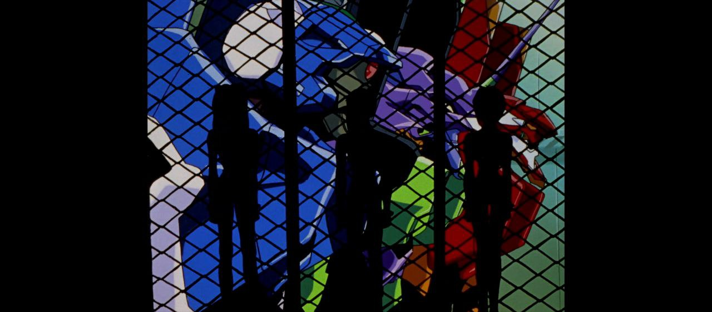
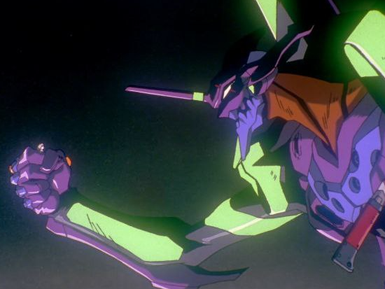

 > 
 > I like how the art-style conveys what it needs to in such proper detail. Some frames are still, where the viewer is guided by only the sound, while in others the characters move but not their background. Sudden movements are limited, but *just* enough to be interesting to watch.

 > 
 > Peak new year

 > 
 > What I didn't notice initially was that some of the episodes' animation style differs from the others in a subtle way. According to a Reddit post, development on most episodes were led by [Gainax](https://en.wikipedia.org/wiki/Gainax) and [Tatsunoko Production](https://en.wikipedia.org/wiki/Tatsunoko_Production), whereas multiple studios were outsourced some of the work, such as [Production I.G](https://en.wikipedia.org/wiki/Production_I.G), [Studio Deen](https://en.wikipedia.org/wiki/Studio_Deen) and Studio Cockpit. Episode 11 was animated by artists from [Studio Ghibli](https://en.wikipedia.org/wiki/Studio_Ghibli), hence why the animation looks similar to their style.

 > 
 > Some genuinely good advice right away.

 > 
 > Sick.

 > 
 > CUTEEEEEEEEEE

 > 
 > Me and my girl when :?

 > 
 > Woah. WOAH. This show's taking a real dark turn.

