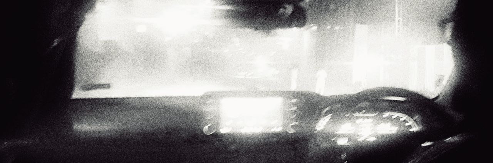
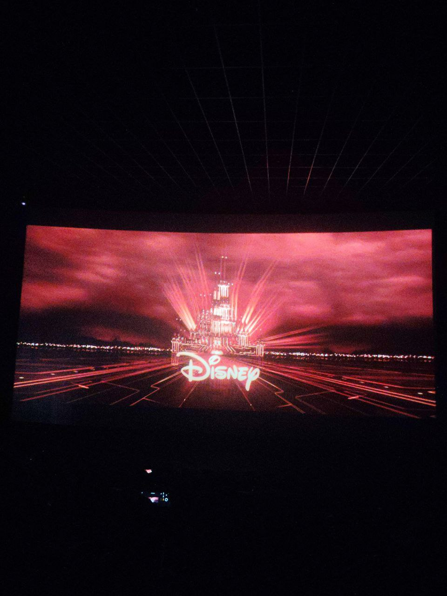
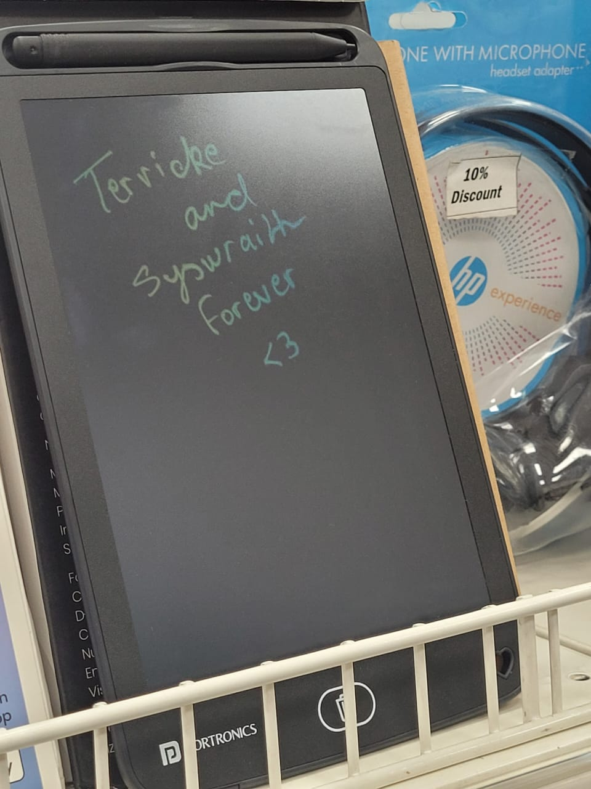
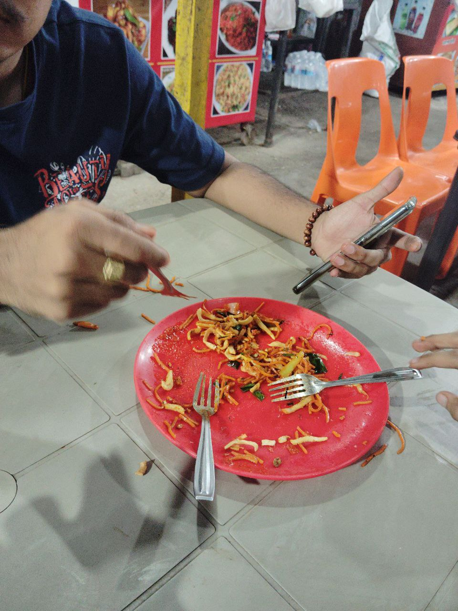
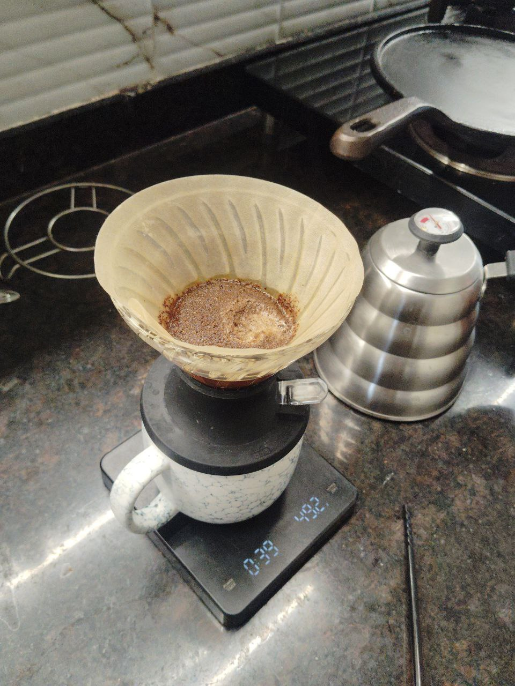
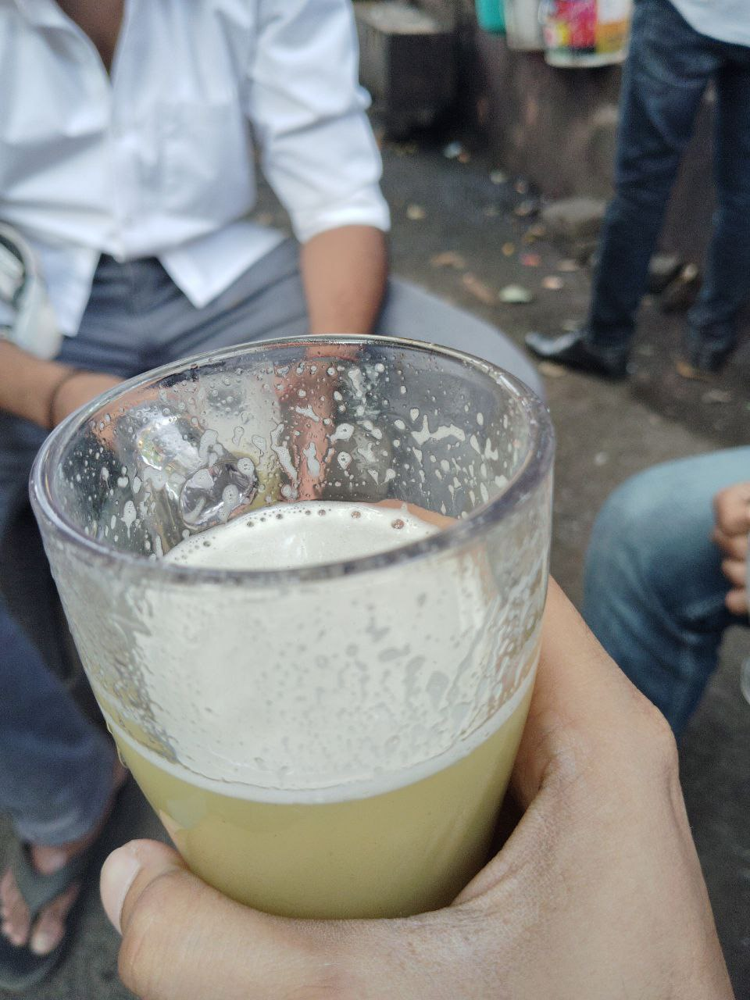
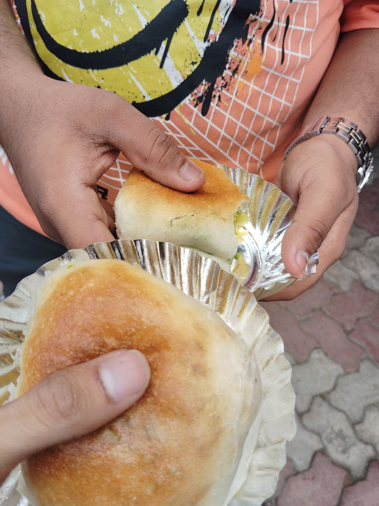
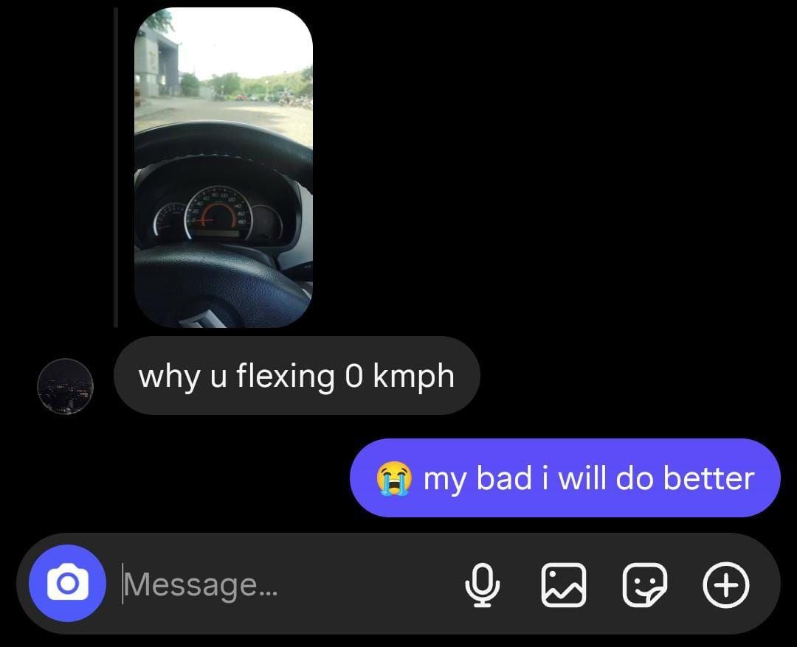

> 
> This is Master Obi-Wan Kenobi.
> 
> I regret to report that both our Jedi Order and the Republic have fallen, with the dark shadow of the Empire rising to take their place.
> 
> This message is a warning and a reminder for any surviving Jedi: trust in the Force.
> Do not return to the Temple.
> That time has passed, and our future is uncertain.
> 
> Avoid Coruscant. Avoid detection. Be secret... but be strong.
> 
> We will each be challenged: our trust, our faith, our friendships.
> 
> But we must persevere and, in time ***a new hope*** will emerge.
> 
> May the Force be with you, always.
